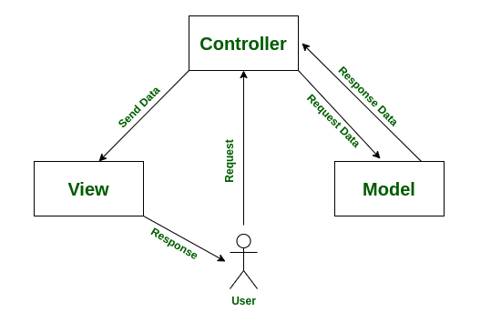
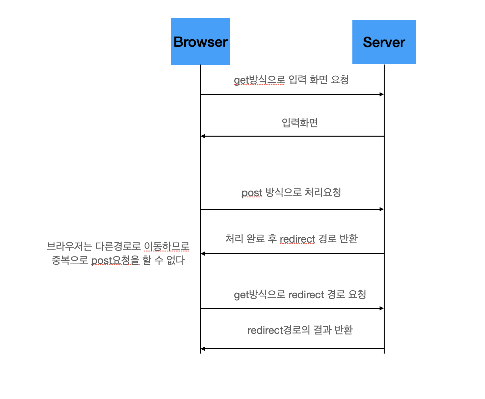
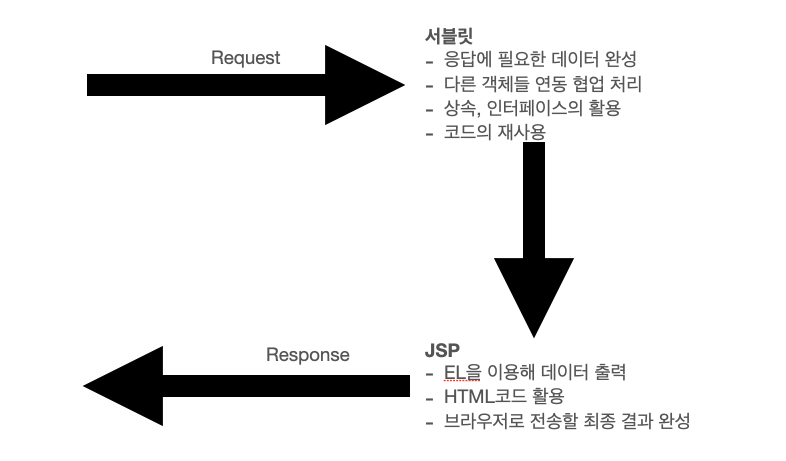

# 9/10

### 자바 서버 사이드 프로그래밍

## 1.1 ~ 1.2 웹프로그램이 시작

### 서블릿이란?

→ 서버에서 동적으로 요청과 응답을 처리할 수 있는 API들을 정의한 것

### JSP이란?

→ 근본적으로 서블릿과 같은 원리지만 좀더 HTML을 쉽게 이용할 수 있는 방식으로 코드를 작성할 수 있기 때문에, 서블릿으로는 코드를 이용한 처리 JSP로는 화면 개발 과 같이 역할을 분담해서 하는 것이 일반적이다.

JSP에도 자바코드를 이용할 수 있지만 사용하기가 불편하기 때문에 나중에 웹 MVC 방법으로 서블릿은 처리를 담당하고 JSP는 처리된 데이터를 보여주는 역할만 하는 방식으로 변화하게 된다.

### 서블릿 컨테이너?

→ 서블릿의 실행은 톰캣과 같이 서블릿을 실행할 수 있는 환경에서 실행이 가능한데 이를 서블릿 컨테이너라고 한다.

- 객체를 생성하거나 호출하는 주체는 사용자가 아닌 서블릿 컨테이너가 하게 된다.
- 서블릿 클래스에서 생성하는 객체의 관리 자체가 서블릿 컨테이너에 의해서 관리된다.
- 서블릿/JSP의 코드 개발은 기본적인 자바 API와 더불어 서블릿 API도 같이 사용해야 한다.
    
    → import에서 javax로 시작하는 패키지는 서블릿  관련 API다.
    

각 서블릿 클래스에서는 HttpServlet이라는 클래스를 상속 받는다.(내부에 init, doGet, destroy등이 정의되어있음)

## 1.3 Web MVC 방식

### MVC 구조와 서블릿/jsp

서블릿을 활용하여 html을 작성하면 상당히 많은 양의 코드를 작성해야 한다.

JSP의 경우 HTML 코드를 바로 이용할 수 있어 장점이 있지만 자바의 코드를 재사용하거나 자바코드와 html 코드가 혼재하는 것 과 같은 여러문제가 존재한다.

따라서 이를 절충 하여 아래 그림과 같은 구조를 이용을 한다.

서블릿에서는 준비된 데이터를 생성하고 이를 JSP는 EL을 활용하여 최종적인 결과를 전달한다.

### MVC 구조

→ 컨트롤러 역할을 하는 서블릿은 JSP에 필요한 데이터를 가공하는 역할을 하는데 이때 필요한 데이터를 제공하는 객체를 모델(Model)이라고 한다. 

### PRG 패턴

→ 웹 MVC 구조에서 가장 흔하게 사용하는 패턴은 POST방식과 Redirect를 결합해서 사용하는 PRG패턴이다.

흐름

- 사용자는 컨트롤러에 원하는 작업을 POST로 요청
- POST 방식을 컨트롤러에서 처리하고 브라우저는 다른 경로로 이동(Get) 하라는 응답(Redirect)
- 브라우저는 GET방식으로 이동

