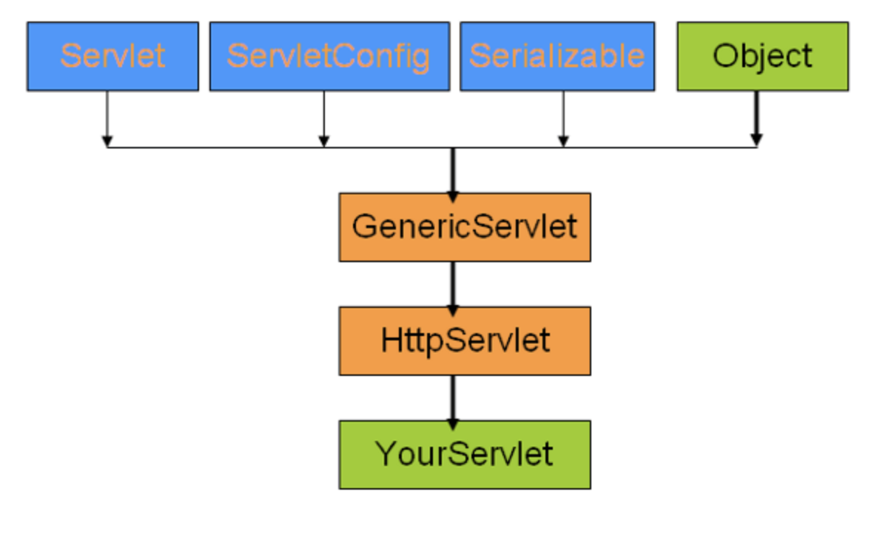

# 9/11

## 1.4 HttpServlet

### HttpServlet의 특징

- HttpServlet을 상속받은 클래스는 톰캣과 같은 WAS에서 내부적으로 자동으로 객체를 생성하고 관리하기 때문에 개발자가 객체 관리에 신경 쓸 필요가 없습니다.
- HttpServlet은 멀티스레드에 의해서 동시에 실행될 수 있게 처리되기 때문에 개발자는 동시에 많은 사용자를 어떻게 처리해야 하는지에 대한 고민을 줄일 수가 있습니다.

HttpServlet은 상위 클래스로 GenericServlet이라는 추상클래스를 상속 한다.

GenericServlet과 HttpServlet의 가장 큰 차이는 GenericServlet의 경우 HTTP프로토콜에 특화 되지 않은 요청과 응답에 대한 기능을 정의하고 있다는 점이다.

### HttpServlet의 라이프 사이클

→ 서블릿은 기본적으로 요청(request)을 처리해서 응답(response)하기 위한 목적으로 설계 됨

서블릿은 웹이라는 특수한 환경에 의해 개발자 대신 톰캣에서 객체를 관리한다. (톰캣은 이러한 이유로 서블릿 컨테이너라고 불림)

개발자가 작성한 클래스는 다음과 같은 과정으로 처리 됨

1. 브라우저가 톰캣에 서블릿이 처리해야 하는 특정한 경로를 호출합니다.
2. 톰캣은 해당 경로에 맞는 서블릿 클래스를 로딩하고 객체를  생성
    
    → 이때 init()메소드가 실행 된다. (최초 인스턴스 생성 시 1번 실행 됨)
    
    → 필요한 시점에 서블릿 클래스를 로딩하는 대신에 실행 시에 로딩하도록 하는 load-on-start-up옵션도 있음
    
3. 생선된 서블릿 객체는 브라우저의 요청에 대한 정보를 분석후 get/post등의 정보와 함께 전달 된 파라미터들을 **HttpServletRequset**라는 타입의 파라미터로 전달 받고**,** 이 과정에서 처리하는데 필요한 기능들은 **HttpServletResponse**라는 타입의 객체로 전달받음
4. 서블릿 내부에서 요청 method에 맞게 doGet/doPost 를 실행한다, 이 후 동일한 주소의 호출이 있을 때 서블릿은 동일한 객체 하나만을 이용 (싱글 인스턴스, 쓰레드 별로 스택을 1개씩 주기 때문에 각각의 함수 내부의 지역 변수는 스택별로 관리되어서 서로 critical session생성x, 쓰레드별로 PC 레지스터 값이 있어 싱글 인스턴스로 여러 요청을 다양한 쓰레드에서 처리 가능)
5. 톰캣이 종료되면 destroy()실행

### HttpServletRequest의 메서드 예시

1. getHeader(String Name), getHeaderNames()
2. getRemoteAddress() : 접속한 사용자의 IP주소
3. getMethod(), getRequestURL(), getRequestURI()
4. getPrameter(String name), getParameterNames(), getParameterValues(String name)
5. getCookies()
6. getRequestDispatcher()
    
    ⇒ RequestDispather란 현재의 요청을 다른 서버의 자원에게 전달하는 용도로 사용 되며 2개의 메서드가 존재
    
    - forward(): 현재 까지의 모든 응답(response)내용은 무시하고 JSP가 작성하는 내용만을 브라우저로 전달
    - include(): 지금까지 만들어진 응답(response)내용 + JSP가 만든 내용을 브라우저로 전달 즉 include전후의 **response객체의 stream을 유지 해준다.**
7. setAttribute(String name, Object O) : JSP로  전달하기 전에 필요한 데이터를 저장하는 경우에 사용