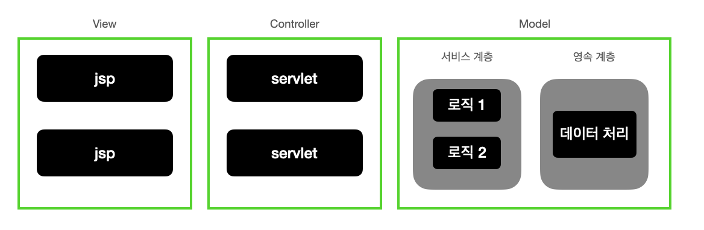

# 9/12

## 1.5 Model (자바 웹개발 워크북)

### 모델과 3티어
→ 웹 MVC 입장에서 모델은 컨트롤러에 필요한 기능이나 데이터를 처리해 주는 존재이나
시스템 전체 구조로 보면 모델은 컨트롤러와 뷰를 제외한 남은 부분이다.

### DTO

→ 3티어와 같이 계층을 분리하는 경우에는 반드시 계층이나 객체들 간에 데이터 교환이 이루어지게 된다.  
이 경우 대부분은 한 개 이상의 데이터를 전달할 때가 많기 때문에 여러 개의 데이터를 묶어서 하나의 객체로 전달하는   것을 DTO라고 한다.  

DTO는 여러 개의 데이터를 묶어서 필요한 곳에 전달하거나 호출을 결과로 받는 방식으로 사용하기 때문에 특별한 규격이나
제약이 있는 것은 아니지만, 대부분은 Java Beans 형태로 구성하는 경우가 많다.

**Java Beans 최소한의 규칙** 
1. 생성자가 없거나 반드시 파라미터가 없는 생성자 함수를 가지는 형태
2. 속성(멤버 변수)는 private으로 작성
3. getter/setter 를 제공

### 