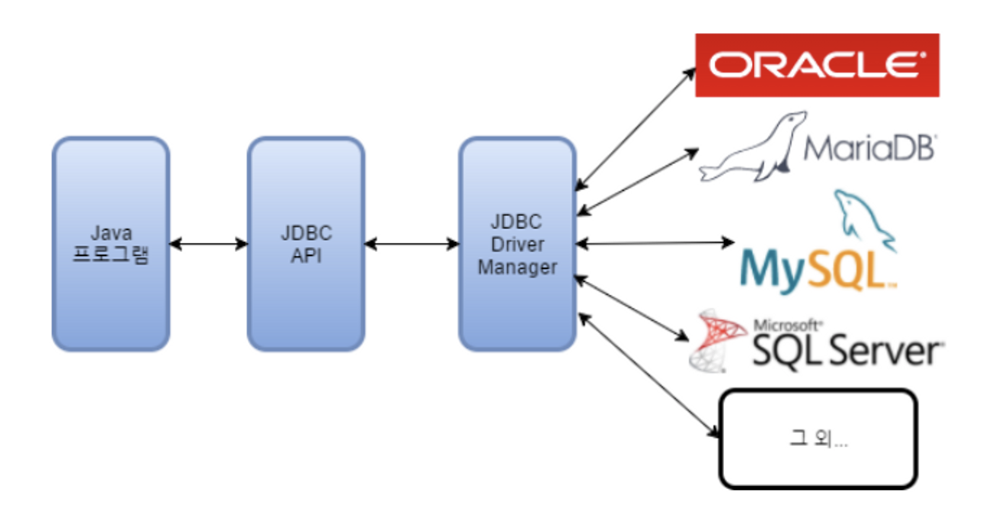

# 9/14

# 2.1  JDBC 프로그래밍 준비

### JDBC프로그램 구조

→ jdbc 프로그램의 java databace connectivity의 약자로 자바 프로그램과 데이터베이스를 네트워크 상에서 연결해 데이터를 교환하는 프로그램으로 관련 API는 java.sql패키지와 javax.sql 패키지를 이용한다.

JDBC 프로그램 작성 순서

1. 네트워크를 통해서 데이터베이스와 연결을 맺는 단계:
2. 데이터베이스에 보낼 SQL을 작성하고 전송하는 단계
3. 필요할 시 데이터베이스가 보낸 결과를 받아서 처리하는 단계
4. 데이터베이스와의 연결을 종료하는 단계

### JDBC 프로그래밍을 위한 API와 용어들

- **java.sql.Connection**
    
    Connection인터페이스는 데이터베이스와의 연결을 의미한다. sql을 실행하기 위해서는 반드시 정상적인 Connection 타입의 객체를 생성해야 한다. 개발자는 Connection이라는 인터페이스를 활용하고 실제 구현 클래스는 JDBC 드라이버 파일 내부의 클래스를 이용한다
    
    JDBC프로그래밍에서 가장 중요한 사실은 ‘Connection은 반드시 close() 해야한다’ 이다.
    
    데이터베이스는 많은 연결을 처리해야하는데 연결이 종료되지 않으면 새로운 연결을 받을 수 없는 상황이 생길 수 있다. Connection 종료를 하기 위해서는 코드 내에서 try catch finally를 사용하거나 try with resources를 사용한다. 후자의 경우 자동으로 close() 호출을 보장한다.
    
- **java.sql.Statement/PreparedStatement**
    
    JDBC에서 SQL을 데이터베이스로 보내기 위해서는 Statement/PreparedStatement 타입을 이용한다. 둘의 차이는 SQL을 전달한다는 점에서 같지만 SQL 문을 미리 전달하고 나중에 데이터를 보내는 방식(PreparedStatement)와 sql 문 내부에 모든 데이터를 문자열로 적어서 보내는 방식이라는 점에서 다르다.
    
    후자의 경우 sql injection 공격의 여지가 있어서 잘 사용하지 않는다.
    
- **java.sql.ResultsSet**
    
    PreparedStatement를 이용해서 /insert/update/delete 를 처리하는 경우 int로 반환되는 것 과 달리 select의 경우 ResultSet이라는 인터페이스를 이용한다. ResultSet은 자바코드에서 데이터를 읽어 들이기 때문에 getInt(), getString()등의 메소드를 이용해서 필요한 타입으로 데이터를 읽어 들입니다.
    
    ResultSet에는 next()라는 메서드가 존재하는데 다음 행의 데이터를 순차적으로 읽을 수 있게 해준다.
    
    ResultSet 역시 네트워크를 통해서 데이터를 읽어드리기 때문에 작업이 끝난 후에는 반드시 close()를 해주어야만 데이터베이스에서도 즉각적으로 자원을 회수한다.
    
- **Connection Pool과 DataSource**
    
    데이터베이스와 연결을 맺는 과정은 많은 시간과 자원이 소모되기 때문에 커넥션 풀을 이용해야 한다.
    
- **DAO(data access object)**
    
    dao는 데이터를 전문적으로 처리하는 객체를 의미한다. 일반적으로 데이터베이스의 접근과 처리를 전담하는 객체를 의미하는데 dao는 주로 vo를 단위로 처리합니다.
    
    dao를 호출하는 객체는 dao가 내부에서 어떤식으로 데이터를 처리하는지 알 수 없도록 구성한다.
    
- **VO(value object) 혹은 엔티티(entity)**
    
    객체지향 프로그램에서 데이터를 객체라는 단위로 처리합니다. 예를 들어 테이블의 한행을 자바 프로그램에서는 하나의 객체가 된다.
    
    데이터베이스에서는 하나의 데이터를 엔티티라고 하는데 자바 프로그램에서는 이를 처리하기 위해서 테이블과 유사한 구조의 클래스를 만들어서 객체로 처리하는 방식을 사용하는데, 이 때 만든 객체는 값을 보관하는 용도 라는 의미에서 vo(value object)라고 한다.
    
    vo와 dto는 유사한 모습이지만 dto가 각 계층을 오고 가는데 사용되는 택배 상자와 비슷하다면 vo는 데이터베이스의 엔티티를 자바 객체로 표현한 것이다.
    
    dto는 getter/setter를 이용해서 자유롭게 데이터를 가공할 수 있는데 비해 vo는 주로 데이터 자체를 의미하므로 getter만 이용하는게 일반적이다/