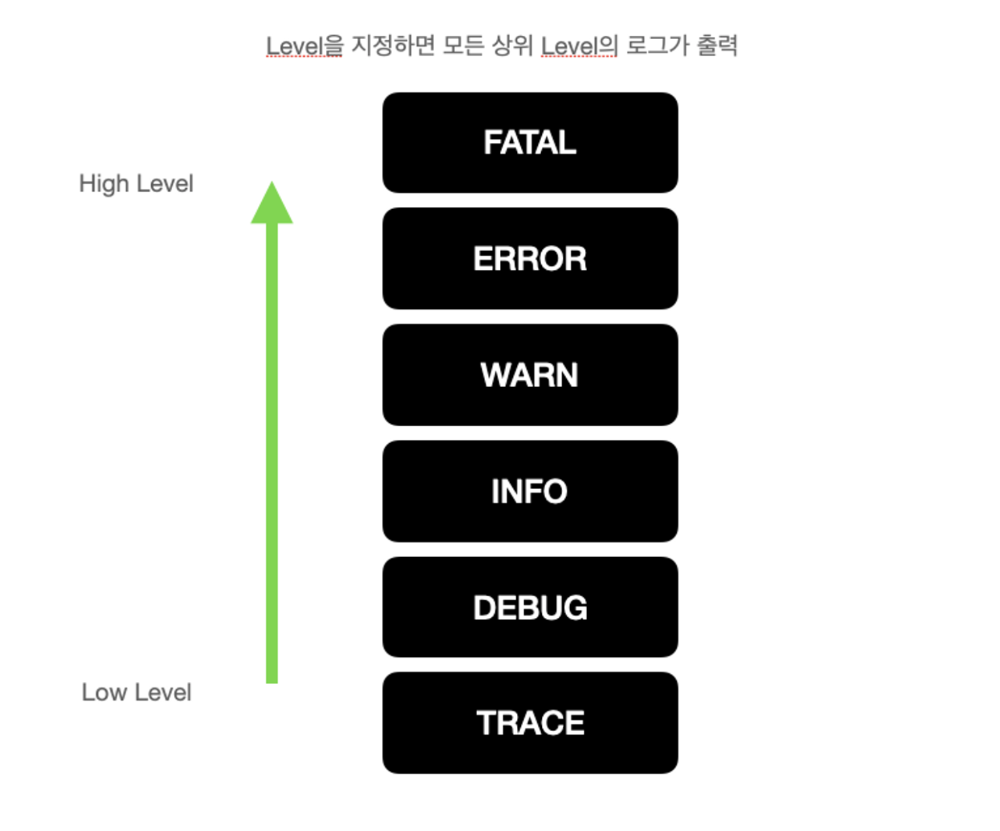

# 9/16

# Log4j2

프로젝트를 개발하다 보면 System.out.println() 을 사용하게 되는데 문제는 개발하고 난 후 대부분의 이런 출력 함수들은 다 삭제하거나 지워야 하는데 여간 귀찮은게 아니고 빼먹을 수 도 있다.

로그(log)기능은 이러한 문제를 해결하기 위한 기능으로 Log4j2가 대표적이다.

Log4j2는 레벨(level)이라는 설정이 있어서 개발할 때,  필요한 레벨의 로그와 실제 운영 시에 필요한 로그를 쉽게 구분할 수 있습니다. Lombok의 경우 @Log4j2라는 어노테이션을 통해 간단히 소스 코드내에 로그를 적용할 수 있습니다.

**** Log4j2의 가장 핵심적인 개념 로그의 레벨(Level)과 어펜더(Appender)이다.****

### 어펜더(Appender)

→ 로그를 어떤 방식으로 기록할 것인지를 의미하는데 콘솔창에 출력할 것인지, 파일로 출력할 것인지 등을 경정한다. System.out.println() 대신에서는 콘솔 어펜더 라는 것을 지정해서 사용한다.

### 레벨(Level)

→로그의 중요도 개념입니다. System.out.println()을 사용하면 모든 내용이 출력되지만 로그의 레벨을 지정하면 해당 레벨이상의 로그들만 출력되기 때문에 개발할 때는 레벨을 낮게 해서 개발하고 운영할 때는 중요한 로그들만 기록하게 설정한다.

위 그림에서 만약 레벨이 ERROR인 경우 FATAL,ERROR레벨의 로그만 출련되게 된다.