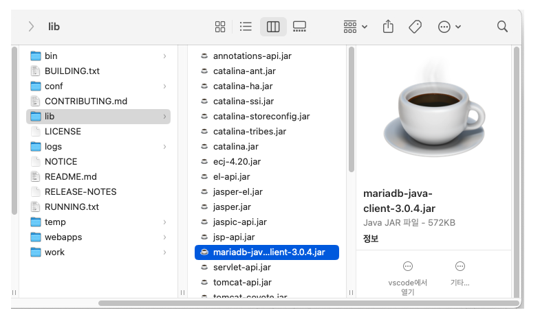

## [톰캣서버 인스턴스 중지에러] 불허되는 접근: 이 웹 애플리케이션 인스턴스는 이미 중지되었습니다 을(를) 로드할 수 없습니다

자바 웹개발자 워크북을 공부중에 코드 (java, jsp)를 수정한 뒤에 갑자기 오류가 떴다.
 

처음부터 떳던 것도 아니고 갑자기 떠서 언제 어디서 어떻게 발생한 건지 알 수없었지만, StackOverFlow에서 해답을 얻을 수 있었다.

 

https://stackoverflow.com/questions/6981564/why-must-the-jdbc-driver-be-put-in-tomcat-home-lib-folder

 

 

솔직히 아무리 읽어도 뭔말인지 이해하기 힘들었는데

 

내가 이해한 바로는...

 

우선 JDBC드라이버들은 JVM-wide 싱글톤인 DriveManager에 스스로 등록된다고 한다.

만약 이 DriveManager에 같은 이름의 JDBC Driver나 같은 JDBC Driver이나 버전이 다른 Driver가 등록되면 위 에러가 뜨는 거라고 한다.

 

DriveManger은 부트스트랩 클래스로더에 의해 로드되기 때문에 JVM에 전역적으로 살아있다고 표현하는데 

부트스트랩 클래스 로더는 자바 클래스를 로드할 수 있는 자바 자체의 클래스 로더와 최소한의 자바 클래스를 로드 해주는데 이때 DriveManager도 로드를 하기때문에 JVM에 가장 기본적으로 전역적으로 올라와있다고 이해하면 될 것 같다.

 

어쨋든 그래서 톰캣은 자신의 클래스 로더(Class Loader)에 모든 웹앱들을 불러오는데 만약 각각의 웹앱들에서 각각의 JDBC Driver를 불러오면 이 각각의 드라이버들이 위에서 말했던 것 처럼 DriveManager에 스스로 등록되려고 할 것이고 등록되면 garbage collection이 방지되는 듯 하다.

 

그러니까 결국 여러 앱들에 JDBC Driver가 계속 등록되고 그게 쌓이면서 메모리 누수를 발생할 수 도 있는 것 같다.

 

그래서 DriveManager 와 JDBC driver를 웹앱이 아닌 다른 클래스 로더에서 불러오면 된다는 것이다.

즉 톰캣에 넣어놓으면 웹앱들을 불러오고 JDBC Driver 참조는 자기(웹앱이 아닌 다른 클래스로더)가 가지고 있는 JDBC Driver만 참조하면 되니까 메모리 누수가 일어나지 않는 것이다.

 

그래서 나도 웹앱 내부의 mariadb  jar파일을 톰캣폴더의 lib에 넣어서 해결하였다.

 

 

스프링 부트를 사용하면 톰캣 내장 되어있어서 이런 문제가 굳이 일어나지 않을 것 같긴 하다.